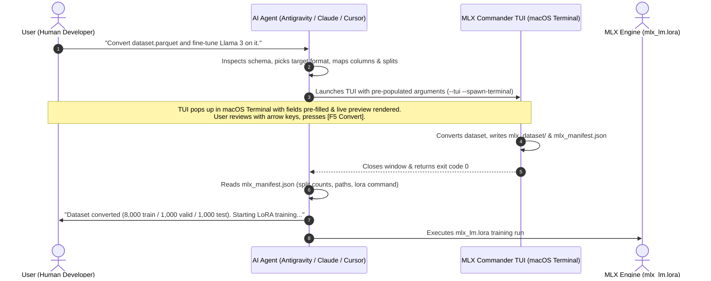

# MLX Commander: Agent Skill for Apple MLX Dataset Preparation

This skill teaches AI agents (such as Antigravity, Claude Code, Cursor, and others) how to prepare and convert datasets for Apple Silicon MLX (`mlx-lm`) fine-tuning.

Instead of asking the user endless sequential questions in chat ("Which column is prompt?", "What split ratio do you want?"), **inspect the dataset, formulate recommended settings, and launch MLX Commander with pre-populated arguments**. 

The user gets an instant 3-second tactile review with live JSONL preview in the TUI, presses **[F5 Convert]**, and hands control back to you with a structured manifest.

---

## When to Activate

Trigger this skill whenever the user:
- Asks to convert a dataset (.parquet, .jsonl, .arrow, .csv, .tsv, .sqlite, .tar) for MLX or Apple Silicon.
- Mentions fine-tuning with `mlx-lm` or `mlx_lm.lora`.
- Asks how to format data for Llama, Mistral, Qwen, or Phi on a Mac.
- Asks to split a dataset into train / valid / test for MLX.

## The 4-Step Agent Workflow



---

### Step 1: Inspect the Dataset Schema

First, inspect the dataset file to detect available columns, rows, and candidate mappings.

You can inspect the dataset quickly via Python:
```python
from mlx_commander.loader import load_local_dataset
from mlx_commander.formats import MLXFormat, auto_detect_mapping

ds = load_local_dataset("path/to/dataset.parquet")
print(f"Rows: {ds.total_rows}, Columns: {ds.columns}")
for fmt in MLXFormat:
    print(fmt.value, auto_detect_mapping(fmt, ds.columns))
```
Or via the MCP tool `inspect_dataset` if running over MCP.

---

### Step 2: Determine MLX Target Format

Apple MLX (`mlx-lm`) expects one of four JSONL schemas:

1. **`prompt_completion`**: Q&A, instruction pairs, or query/code.
   - Schema: `{"prompt": "<user question>", "completion": "<assistant answer>"}`
   - Best for: standard instruction tuning, question answering, summarization.
2. **`chat`**: Multi-turn conversations.
   - Schema: `{"messages": [{"role": "system|user|assistant", "content": "..."}]}`
   - Best for: dialog models, chat assistants, ShareGPT or OpenAI-style data.
3. **`text`**: Raw causal language modeling / pre-training.
   - Schema: `{"text": "<full document or concatenated prompt+completion>"}`
   - Best for: continued pre-training, code completion, domain corpus ingestion.
4. **`dpo`**: Preference optimization (Direct Preference Optimization).
   - Schema: `{"prompt": "...", "chosen": "...", "rejected": "..."}`
   - Best for: alignment, RLHF/DPO training.

---

### Step 3: Launch MLX Commander with Pre-Population

Never ask the user to type columns or splits. Pre-fill your best inferences into the command:

#### Mode A: Interactive TUI Review (Recommended for User-Facing Tasks)
Launch the TUI with `--spawn-terminal` so it pops up in a native macOS Terminal window with the live JSONL preview rendered immediately:

```bash
mlx_commander --tui --spawn-terminal \
  --dataset "path/to/dataset.parquet" \
  --format prompt_completion \
  --prompt-col question \
  --completion-col answer \
  --train 80 --valid 10 --test 10 \
  --output "./mlx_dataset" \
  --manifest-file "./mlx_dataset/mlx_manifest.json"
```

Or pass a `--prefill-state` JSON string:
```bash
mlx_commander --tui --spawn-terminal \
  --prefill-state '{"dataset": "path/to/dataset.parquet", "format": "chat", "messages_col": "conversations", "train": 90, "valid": 10, "test": 0}'
```

The command will block until the user presses **[F5 Convert]** or **[F10 / ESC Exit]**.

#### Mode B: Automated Headless Conversion (Only when explicitly asked)
If the user explicitly says *"Don't ask, convert it in the background"*:
```bash
mlx_commander \
  --dataset "path/to/dataset.parquet" \
  --format prompt_completion \
  --prompt-col question \
  --completion-col answer \
  --train 80 --valid 10 --test 10 \
  --output "./mlx_dataset"
```

---

### Step 4: Process the Manifest Handshake

Upon completion, MLX Commander writes `mlx_manifest.json` inside the output directory (or at `--manifest-file`):

```json
{
  "status": "success",
  "format": "prompt_completion",
  "output_dir": "/path/to/mlx_dataset",
  "files": {
    "train": {"path": "/path/to/mlx_dataset/train.jsonl", "records": 8000},
    "valid": {"path": "/path/to/mlx_dataset/valid.jsonl", "records": 1000},
    "test": {"path": "/path/to/mlx_dataset/test.jsonl", "records": 1000}
  },
  "total_records": 10000,
  "mlx_lora_command": "mlx_lm.lora --model mlx-community/Llama-3.2-3B-Instruct-4bit --train --data /path/to/mlx_dataset --mask-prompt --iters 600 --batch-size 4"
}
```

1. Read the manifest to verify `"status": "success"`.
2. Report the summary to the user:
   - Split sizes (`train.jsonl: 8,000`, `valid.jsonl: 1,000`, `test.jsonl: 1,000`).
3. Offer to run or customize the MLX LoRA training command:
   ```bash
   mlx_lm.lora \
       --model mlx-community/Llama-3.2-3B-Instruct-4bit \
       --train \
       --data /path/to/mlx_dataset --mask-prompt \
       --iters 600 \
       --batch-size 4
   ```

If the user cancelled in the TUI, exit code `130` is returned. Acknowledge cancellation without executing further training steps.
