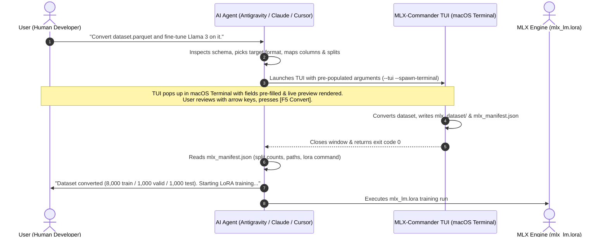

# MLX-Commander 🚀

A fast, persistent dual-panel TUI (Norton Commander style) & CLI converter for preparing Hugging Face datasets into Apple Silicon MLX fine-tuning formats (`mlx-lm`).

Built entirely with Python's standard library `curses` with zero mandatory dependencies and zero pre-compiled binaries.

---

## 🌟 Key Features

- **Persistent Multi-Panel TUI (Norton Commander style)**: Full keyboard navigation (`Tab` to switch panels, `↑`/`↓` to navigate, `Enter` to edit/open dropdowns, `F2` for Finder, `F5` to convert).
- **AI Agent Skill & TUI Pre-Population**: Coding agents (Antigravity, Claude, Cursor) can inspect dataset schemas, pre-populate format, column mappings, and splits, and launch the TUI for split-second visual confirmation.
- **macOS Terminal.app Spawner**: Seamless handoff from non-interactive agent environments to an interactive TUI window via AppleScript.
- **Model Context Protocol (MCP) Server**: Native stdio MCP server exposing dataset inspection, TUI launching, and headless conversions to Claude Desktop and Cursor.
- **Machine-Readable Manifest (`mlx_manifest.json`)**: Emits structured output with file paths, row counts, and copy-paste `mlx_lm.lora` commands for automated downstream pipelines.
- **Multi-File Selection & Dataset Merging**: Select multiple dataset files at once (e.g. combining pre-split `train.jsonl` and `test.jsonl`). Verifies that all files have identical column schemas and merges them so you can randomize fresh Train / Validation / Test sets from scratch with a custom seed.
- **Multi-Column Concatenation**: Tap `Space` to multi-select and order columns from the original dataset (e.g. `instruction + input`) to concatenate them seamlessly with `\n\n`.
- **Live Reactive Preview**: Sample records format in real time as you change target formats or adjust column mappings.
- **Instantaneous ESC Response**: Curses escape delay configured to 25ms (< 1 frame), making modal dismissal instantaneous while preserving arrow and function keys.
- **Native macOS Cocoa Finder Picker**: Seamlessly select dataset folders or files via native macOS dialogs (compiled on the fly in `/tmp` with zero checked-in binaries).
- **Supported MLX Formats**:
  1. **Text Format**: `{"text": "..."}` — Causal LM / pre-training (single column, concatenated columns, or custom template).
  2. **Chat / Messages Format**: `{"messages": [{"role": "system|user|assistant", "content": "..."}]}` — Supports message lists (standard role/content or ShareGPT `from`/`value`), or separate role columns.
  3. **Prompt & Completion Format**: `{"prompt": "...", "completion": "..."}` — Q&A / instruction fine-tuning (`mlx_lm.lora --mask-prompt` compatible).
  4. **DPO / Preference Format**: `{"prompt": "...", "chosen": "...", "rejected": "..."}` — Direct Preference Optimization.
- **Flexible Data Loader**: Parquet (`.parquet`), Arrow (`.arrow`), Hugging Face `save_to_disk` directories, JSONL (`.jsonl`), JSON arrays (`.json`), CSV (`.csv`), TSV (`.tsv`), SQLite (`.sqlite`, `.db`), and WebDataset (`.tar`).
- **Deterministic Splits & Random Seed**: Customizable Train / Validation / Test percentages with 100% reproducible shuffling via random seed.
- **Ready-to-Use `mlx_lm.lora` Command**: Generates the exact training command ready to copy-paste.
- **CLI Wizard & Headless Modes**: Run line-by-line via `--wizard` or fully automated via headless CLI flags.

---

## 📦 Quick Start

### 1. Launch MLX-Commander (Default)

Launch the interactive dashboard using any of these equivalent commands:

```bash
# Recommended for local repository execution:
python3 run.py

# Or as a Python package module:
python3 -m mlx_commander

# Or via zero-install uvx:
uvx mlx-commander
```

You can also pass arguments directly (e.g. pre-loading a dataset or multiple files):
```bash
python3 run.py -d /path/to/my_hf_dataset
# Or combine multiple files:
python3 run.py -d train.jsonl test.jsonl
```

### 2. Line-by-Line Wizard Mode

For SSH sessions or non-curses environments:

```bash
./mlx-commander --wizard
```

### 3. Direct Command-Line Conversion (Automated / Headless)

You can pass all options via flags for direct scripted conversions:

```bash
./mlx-commander \
  --dataset /path/to/my_hf_dataset \
  --format prompt_completion \
  --prompt-col instruction \
  --completion-col output \
  --output ./mlx_data \
  --train 80 \
  --valid 10 \
  --test 10 \
  --seed 42
```

---

## 🖥️ Command Line Reference

```
usage: mlx-commander [-h] [-v] [-d DATASET [DATASET ...]]
                     [-f {text,chat,prompt_completion,dpo}]
                     [-o OUTPUT] [--train TRAIN] [--valid VALID] [--test TEST]
                     [--seed SEED] [--keep-splits] [--mapping MAPPING]
                     [--text-col TEXT_COL] [--text-template TEXT_TEMPLATE]
                     [--prompt-col PROMPT_COL] [--completion-col COMPLETION_COL]
                     [--messages-col MESSAGES_COL] [--user-col USER_COL]
                     [--assistant-col ASSISTANT_COL] [--system-col SYSTEM_COL]
                     [--chosen-col CHOSEN_COL] [--rejected-col REJECTED_COL]
                     [--commander] [--wizard]
```

### Key Flags:

| Flag | Description |
|---|---|
| `-d`, `--dataset` | Path to HF dataset directory or file on disk (`.arrow`, `.parquet`, `.jsonl`, `.json`, `.csv`). |
| `-f`, `--format` | Target MLX format (`text`, `chat`, `prompt_completion`, `dpo`). |
| `-o`, `--output` | Destination directory where `train.jsonl`, `valid.jsonl`, and `test.jsonl` are saved. |
| `--train` | Percentage of data for training (e.g. `80.0`). |
| `--valid` | Percentage of data for validation (e.g. `10.0`). |
| `--test` | Percentage of data for test (e.g. `10.0`, or `0` to omit). |
| `--seed` | Integer random seed for reproducible random shuffling. |
| `--keep-splits` | Preserve existing dataset splits without re-splitting. |
| `--text-col` | Column to use as `text` for `text` format. |
| `--text-template`| Template string with `{column_name}` variables for `text` format. |
| `--prompt-col` | Column to map to `prompt`. |
| `--completion-col` | Column to map to `completion`. |
| `--messages-col` | Column containing conversation turns list for `chat` format. |
| `--user-col` | Column for user turn in multi-column `chat` format. |
| `--assistant-col`| Column for assistant turn in multi-column `chat` format. |
| `--system-col` | Column for system prompt in multi-column `chat` format. |
| `--chosen-col` | Column for preferred response in `dpo` format. |
| `--rejected-col`| Column for dispreferred response in `dpo` format. |
| `--manifest-file`| Custom file path where machine-readable `mlx_manifest.json` will be saved. |
| `--prefill-state`| Pre-populate TUI state from a JSON string or path to JSON file. |
| `--spawn-terminal`| Launch interactive TUI in an external macOS Terminal window. |
| `--mcp` | Start Model Context Protocol (MCP) server over stdio. |
| `--tui` | Force launch full-screen curses TUI. |
| `--no-tui`, `--cli` | Run line-by-line CLI wizard instead of curses TUI. |

---

## 🤖 AI Agent Integration & MCP Support

MLX-Commander is designed for the modern AI agent era (**Antigravity**, **Claude Desktop**, **Cursor**, **Zed**, **Cline**). 

Instead of an agent interrogating users with 10 sequential chat prompts or guessing schemas blindly, agents can **inspect schemas, formulate recommended settings, and launch MLX-Commander with pre-populated values**. 

The user gets a 3-second tactile review with live JSONL preview in the Norton Commander TUI, presses **[F5 Convert]**, and hands control back to the agent with a machine-readable manifest.

### 🔄 The End-to-End Workflow



---

### The Three Architectural Hand-offs

#### 1. Hand-off 1: TUI State Pre-Population
Agents can pre-populate every field of `CommanderState` via CLI flags or a JSON payload:
- **Via CLI Flags**:
  ```bash
  mlx-commander --tui --spawn-terminal \
    --dataset "./data.parquet" \
    --format chat \
    --messages-col conversations \
    --train 85 --valid 15 \
    --output "./mlx_dataset"
  ```
- **Via JSON (`--prefill-state`)**:
  ```bash
  mlx-commander --tui --spawn-terminal \
    --prefill-state '{"dataset": "./data.parquet", "format": "prompt_completion", "prompt_col": "question", "completion_col": "answer", "train": 80, "valid": 20}'
  ```
When launched with pre-fill data, the TUI opens directly with focus on the mappings panel and renders the reactive JSONL preview immediately.

#### 2. Hand-off 2: Machine-Readable Manifest Handshake (`mlx_manifest.json`)
Every conversion automatically outputs `output_dir/mlx_manifest.json` (or to a custom path specified with `--manifest-file <path>`):

```json
{
  "status": "success",
  "format": "prompt_completion",
  "source_path": "/path/to/source.parquet",
  "output_dir": "/path/to/mlx_dataset",
  "files": {
    "train": {
      "path": "/path/to/mlx_dataset/train.jsonl",
      "filename": "train.jsonl",
      "records": 8000,
      "size_bytes": 1048576
    },
    "valid": {
      "path": "/path/to/mlx_dataset/valid.jsonl",
      "filename": "valid.jsonl",
      "records": 1000,
      "size_bytes": 131072
    },
    "test": {
      "path": "/path/to/mlx_dataset/test.jsonl",
      "filename": "test.jsonl",
      "records": 1000,
      "size_bytes": 131072
    }
  },
  "splits": { "train": 8000, "valid": 1000, "test": 1000 },
  "total_records": 10000,
  "seed_used": 42,
  "mlx_lora_command": "mlx_lm.lora --model mlx-community/Llama-3.2-3B-Instruct-4bit --train --data /path/to/mlx_dataset --mask-prompt --iters 600 --batch-size 4",
  "manifest_path": "/path/to/mlx_dataset/mlx_manifest.json"
}
```

- **Exit Code 0**: Conversion succeeded; manifest written.
- **Exit Code 130**: User cancelled/closed the TUI without converting. If `--manifest-file` was set, writes `{"status": "cancelled"}`.

#### 3. Hand-off 3: macOS Terminal.app Spawner
When invoked by background agent runners (such as IDE extensions, subshells, or MCP daemons) without an active TTY:
- Passing `--spawn-terminal` (or auto-detected on macOS in non-interactive sessions) executes the TUI in a dedicated macOS `Terminal.app` window via AppleScript.
- The calling process blocks synchronously until the user converts or exits, then unblocks and returns the exit code and manifest.

---

### Model Context Protocol (MCP) Server

MLX-Commander includes a built-in MCP server that works over `stdio`.

#### 1. Claude Desktop Setup (`claude_desktop_config.json`):
```json
{
  "mcpServers": {
    "mlx-commander": {
      "command": "python3",
      "args": ["-m", "mlx_commander", "--mcp"]
    }
  }
}
```
*Or via zero-install `uvx`:*
```json
{
  "mcpServers": {
    "mlx-commander": {
      "command": "uvx",
      "args": ["--with", "mcp", "mlx-commander", "--mcp"]
    }
  }
}
```

#### 2. Cursor Setup (`.cursor/mcp.json`):
```json
{
  "mcpServers": {
    "mlx-commander": {
      "command": "python3",
      "args": ["-m", "mlx_commander", "--mcp"]
    }
  }
}
```

#### 3. Exposed MCP Tools:

| MCP Tool | Description | Arguments |
|---|---|---|
| `inspect_dataset` | Inspects columns, total rows, split names, sample records, and auto-detects candidate mappings. | `dataset_path: str` |
| `launch_conversion_tui` | Pre-populates and opens the TUI in macOS Terminal.app for user review. Returns conversion manifest. | `dataset_path`, `format`, `prompt_col`, `completion_col`, `messages_col`, `train_pct`, `valid_pct`, `test_pct`, `output_dir` |
| `convert_dataset_headless` | Runs direct headless conversion in background without opening TUI. Returns conversion manifest. | Same arguments as `launch_conversion_tui` |

#### 4. Exposed MCP Prompt:
- **`prepare_dataset_for_mlx`**: Instructs the model on the optimal workflow to inspect the schema, formulate column mappings, and launch the conversion TUI.

---

### Agent Skill (`SKILL.md`)

A standardized skill specification is included in the repository:
- Skill path: [`.agents/skills/mlx-dataset-prep/SKILL.md`](.agents/skills/mlx-dataset-prep/SKILL.md)

AI agents that support skill discovery (like **Antigravity**) automatically read this file when users ask to convert datasets or fine-tune models with Apple MLX.

---

## 🛠️ Step-by-Step Wizard Walkthrough

1. **Step 1: Dataset Source**: Select your dataset folder or file on your drive. The tool validates the file, inspects column names, row counts, and existing splits.
2. **Step 2: MLX Format**: Choose your target format (`Text`, `Chat / Messages`, `Prompt & Completion`, `DPO / Preference`).
3. **Step 3: Column Mapping**: Match dataset columns to MLX fields or enter a formatting template. The tool automatically detects candidate columns.
4. **Step 4: Splitting & Seed**: Configure Train / Valid / Test percentages. A random seed is automatically generated, and you can accept it or provide your own.
5. **Step 5: Output & Preview**: Specify the destination folder, review a live preview of the formatted JSONL lines, and confirm to write the files.
6. **Step 6: Ready to Fine-Tune**: Review written file sizes, row counts, and copy the generated `mlx_lm.lora` fine-tuning command.

---

## 🚀 Running Fine-Tuning with Apple MLX

Once your dataset is converted, fine-tune an LLM on Apple Silicon with `mlx-lm`:

```bash
mlx_lm.lora \
    --model mlx-community/Llama-3.2-3B-Instruct-4bit \
    --train \
    --data ./mlx_dataset \
    --mask-prompt \
    --iters 600 \
    --batch-size 4
```

---

## 🧪 Running Unit Tests

Run the test suite with Python's built-in `unittest`:

```bash
.venv/bin/python -m unittest discover -s tests -p "test_*.py" -v
```
